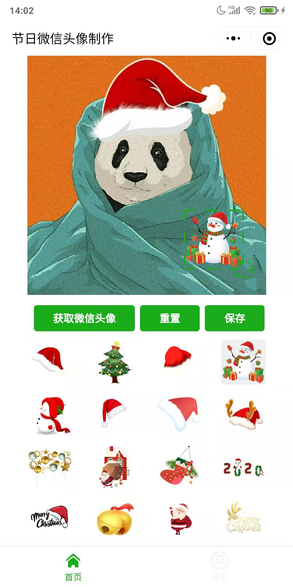

# wechat-head-image

项目名称：微信头像处理小程序

主要功能：给微信头像添加圣诞风格的特殊图标，例如圣诞帽、雪人等。

关键词：给我一顶圣诞帽；微信头像制作；微信头像生成。

小程序调试基础库：1.21.1

更新时间：2021年12月17日

**在线微信小程序体验：**

**微信公众号体验：**

## 截图

## 原项目

本项目基于 netyouli 的 whc_wechat_image_edit 项目修改，删掉了一些功能，修复了一些新版本小程序兼容的问题。

https://github.com/netyouli/whc_wechat_image_edit

**项目更新内容**

1. 修改了获取微信头像按钮的位置，原项目中默认只显示一个获取微信头像的按钮，按照现在的小程序规范，无法过审。

2. 修改了获取微信头像的 API 接口，原项目接口中，因兼容性问题，获取微信头像失败。

3. 删除了原项目中的海报生成功能和节日选择功能。

4. 修改了关于页面的部分信息。

   

## 注意：

### 1. 域名配置

小程序发布上线，需要在小程序后台，添加服务器域名配置。
https://mp.weixin.qq.com （这个也可以不配，微信服务的根域名）
https://thirdwx.qlogo.cn

### 2. 隐私协议
小程序上线审核，需要填写新版隐私协议。
本小程序用到两个涉及隐私的接口：
1. 获取个人微信头像 Uri，用于获取头像图片。
2. 保存相册功能，用于保存处理后的微信头像图片。

### 3. 其它
如有其他问题或定制需求，欢迎联系我沟通交流。

## License

Apache License 2.0
